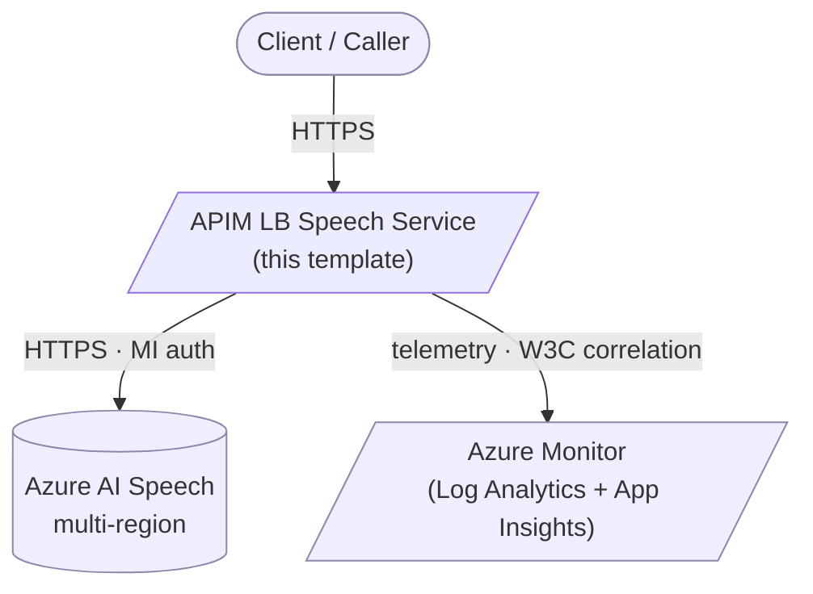

# Architecture overview

The system has two operating modes against the same backend pool:

| Mode | Speech API | Stateful? | Why |
|---|---|---|---|
| **Stateless** | Fast Transcription (`/transcriptions:transcribe`) | No | Single round-trip, no jobId, no need for backend affinity |
| **Stateful** | Batch v3.2 (`/transcriptions/{jobId}`) | Yes | Job lives on the backend that accepted the POST |

Both modes traverse the same APIM gateway, the same Function App, and
the same Speech accounts.

## System context (C4 level 1)

## Container view (C4 level 2)

```mermaid
flowchart LR
    subgraph caller [Caller]
        client([Client])
    end

    subgraph rg [Resource Group · single region per stamp]
        fa[Function App<br/>Python 3.11 · FC1<br/>anonymous auth]
        apim[API Management<br/>Basic v2<br/>round-robin + cache pin]
        kv[(Key Vault<br/>opt-in · AMR conn-string)]
        amr[(Azure Managed Redis<br/>opt-in · external cache)]
        ai[(Application Insights)]
        la[(Log Analytics)]
        sa[(Storage account<br/>FC1 deployment storage)]
    end

    subgraph speech [Azure AI Speech]
        s1[(Brazil South · S0)]
        s2[(South Central US · S0)]
    end

    client -->|HTTPS| fa
    fa -->|HTTPS| apim
    apim -->|MI · Cognitive Services User| s1
    apim -->|MI · Cognitive Services User| s2
    fa -.->|MI · Storage Blob Data Owner| sa
    apim -.->|secret · @secure&#40;&#41;| kv
    apim -.->|TLS :10000<br/>external cache| amr
    fa -->|telemetry| ai
    apim -->|diagnostics| la
    ai --> la
```

The Key Vault and Azure Managed Redis containers are only provisioned when
`AZURE_USE_EXTERNAL_CACHE=true`. By default APIM uses its own internal
cache, which is sufficient for a single APIM instance.

## Key building blocks

### APIM Basic v2 backend pool

- One backend per Speech account, equal weight, equal priority.
- Pool routes round-robin (GA in `Microsoft.ApiManagement/service/backends@2024-05-01`).
- Each backend has a circuit breaker: 5 failures / minute → 30 s trip.
- API-level retry on 429 and 5xx: 3 attempts, exponential-ish backoff.

### JobId → backend pinning

Stateful batch calls require *all* operations on a jobId (poll, files,
delete) to land on the backend that accepted the original `POST`.
APIM solves this with a small lookup keyed by jobId:

- **On submit (POST)**: outbound policy parses the upstream `Location`
  header, derives the jobId (last path segment), and writes
  `jobId → backend-id` into the pinning cache with a 24 h TTL.
- **On poll / files / delete**: inbound policy looks up
  `jobId → backend-id` and routes to that backend; cache miss falls
  back to the round-robin pool (acceptable for cold reads).

The cache uses `caching-type="prefer-external"`, which means it
transparently uses the **APIM internal cache** by default and the
**Azure Managed Redis** external cache when bound (opt-in via
`AZURE_USE_EXTERNAL_CACHE=true`).

See [ADR-0002](../adr/0002-apim-cache-pin-stateful-batch.md) for the full
rationale, and [the stateful sequence diagram](sequence-stateful.md) for
the call-by-call walkthrough.

### Idempotency layer

Both `POST /api/submit-batch` and `POST /api/transcribe` honour an
`Idempotency-Key` header. Same key + same body → cached 2xx replay with
`X-Idempotent-Replay: true`. Same key + different body → `422
IdempotencyKeyConflict`. Concurrent in-flight retries → `409
IdempotencyInFlight` + `Retry-After: 5`. TTL configurable via
`AZURE_IDEMPOTENCY_TTL_SECONDS` (default 3600).

The same APIM cache that holds the jobId-pin holds the idempotency
records; this is intentional — both have the same lifecycle and the
same scaling story.

### Managed-identity-end-to-end

- APIM MI → `Cognitive Services User` on each Speech account.
- Function MI → `Storage Blob Data Owner` on FC1 deployment storage.
- Speech: `disableLocalAuth: true` (account keys are not usable).
- Storage: `allowSharedKeyAccess: false`, `defaultToOAuthAuthentication: true`.
- Function App: `httpsOnly: true`, TLS 1.2 minimum, FTPS disabled.

No shared keys exist anywhere in the deployed configuration.

## Where to read more

- [Stateful sequence diagram](sequence-stateful.md) — full
  cache-pin walkthrough.
- [ADR-0001](../adr/0001-record-architecture-decisions.md) — why we keep ADRs.
- [ADR-0002](../adr/0002-apim-cache-pin-stateful-batch.md) — cache-pin design.
- [ADR-0003](../adr/0003-flex-consumption-python-runtime.md) — runtime choice.
