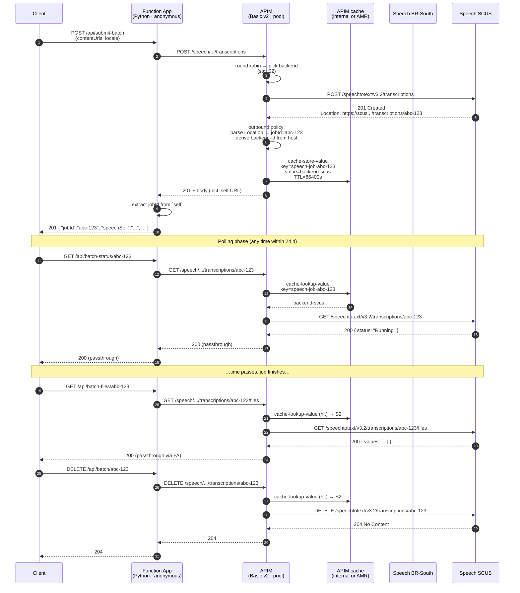

# Stateful sequence: jobId pinning end-to-end

This walks through a single batch transcription job from submit to
delete, showing how APIM keeps every call on the same Speech backend
without the client knowing or caring.

## Submit → Poll → Files → Delete

## Failure modes and how they are handled

### Cache miss on a poll

If the pinning entry expires (TTL = 24 h) before the client polls, the
`cache-lookup-value` returns nothing. The policy falls back to the
round-robin pool, which has a roughly 50% chance of routing to the
correct backend.

**Wrong backend → 404**: a 404 response from a poll is the canonical
load-test failure signal. We do not silently retry — the client sees a
404 and can decide to re-submit with a fresh idempotency key.

### Backend trip-out

If a backend's circuit breaker has tripped (5 failures / minute), the
pool skips it and routes to the healthy partner. For *stateful* calls
this is a problem: the job lives on the tripped backend. The pinning
policy is intentionally *not* aware of circuit breaker state — the
poll will get a 503 from the still-warming-up backend rather than
silently routing to the wrong one.

### Concurrent retries with the same idempotency key

Best-effort guard: APIM writes a `speech-idem-lock-<key>` sentinel
before forwarding upstream. A second arriving request that finds the
sentinel returns `409 IdempotencyInFlight` + `Retry-After: 5`. APIM's
cache has no atomic compare-and-set, so a tight burst of true-
simultaneous arrivals can race past the sentinel. The post-completion
replay path (cached 2xx body keyed by `speech-idem-<key>`) catches them
and serves the original response with `X-Idempotent-Replay: true`.

## Why this works

The contract is one-way: jobIds are minted by *Speech*, not by the
client and not by APIM. APIM only has to remember which backend minted
which jobId. A simple key-value lookup with a long TTL is sufficient —
no consensus, no cross-instance coordination (when running on a single
APIM instance), no application-level state.
