# APIM LB Speech Service — Documentation

> Multi-region Azure Speech-to-Text behind APIM, with stateful jobId→backend
> pinning for the batch transcription API. End-to-end managed-identity auth.

This site is the single source of truth for the design and operational
guidance of the project. The repository [README](https://github.com/seilorjunior/apim-lb-speech-service)
is intentionally short and links here for depth.

## Where to start

| If you want to… | Read |
|---|---|
| Understand the moving parts | [Architecture overview](architecture/overview.md) |
| Trace a stateful batch call end-to-end | [Stateful sequence diagram](architecture/sequence-stateful.md) |
| See why a design choice was made | [Architecture Decision Records](adr/README.md) |
| Use the Function App from code | [API reference](api-reference.md) |
| Contribute / run tests locally | [CONTRIBUTING.md](https://github.com/seilorjunior/apim-lb-speech-service/blob/main/CONTRIBUTING.md) |

## High-level shape

```mermaid
flowchart LR
    Client([Client])
    FA[Function App<br/>Python 3.11 · FC1]
    APIM[APIM Basic v2<br/>round-robin + cache pin]
    S1[(Speech<br/>Brazil South)]
    S2[(Speech<br/>South Central US)]

    Client -->|POST /transcribe<br/>POST /submit-batch<br/>GET  /batch-status/&#123;jobId&#125;| FA
    FA -->|forward| APIM
    APIM -->|MI · round-robin| S1
    APIM -->|MI · round-robin| S2
```

## Project status

This is a **public dev sample**, not a production-hardened deployment.
Specifically:

- APIM has no client auth (anonymous Function exposed publicly).
- All resources live on the public network.
- No WAF, no private endpoints.

See the [README §Notes & limitations](https://github.com/seilorjunior/apim-lb-speech-service#notes--limitations)
before reusing.
